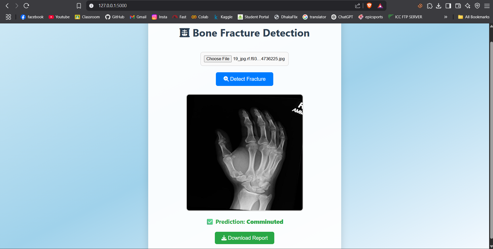

<h1 align="center">🦴 Bone Fracture Detection using YOLOv8</h1>

<p align="center">
  
  
</p>

<p align="center">
  A full-stack AI-powered web application to detect bone fractures from X-ray images using a YOLOv8 deep learning model.
</p>

<p align="center">
 
</p>


## 🚀 Features

<ul>
  <li>🧠 YOLOv8 model trained on 10 fracture classes</li>
  <li>📸 Upload and preview X-ray images</li>
  <li>🔍 Predict fractures and display the classes</li>
  <li>📄 Downloadable text report after prediction</li>
  <li>🌈 Beautiful modern UI with animated feedback</li>
</ul>

## 📦 Dataset

[](https://www.kaggle.com/datasets/orvile/human-bone-fractures-image-dataset-hbfmid)

This project is based on the [Human Bone Fractures Multi-modal Image Dataset (HBFMID)](https://www.kaggle.com/datasets/orvile/human-bone-fractures-image-dataset-hbfmid), a collection of X-ray images representing 10 types of bone fractures.


## 📁 Project Structure

```bash
bone-fracture-detection/
├── app.py                         # Flask backend API
├── human_bone_fractures_image.ipynb  # Notebook used to train the model
├── yolov8n-fracture.pt            # Trained YOLOv8 model
├── templates/
│   └── index.html                 # Frontend HTML interface
├── static/                        # (Optional) folder for CSS/JS
├── uploads/                       # Temporary storage for uploaded images
└── README.md                      # Project description
```


## 🧪 How to Run Locally

1. **Clone the Repository**  
   ```bash
   git clone https://github.com/mishehab/bone-fracture-detection.git
   cd bone-fracture-detection

2. **Install Python Dependencies**

   ```bash
   pip install flask flask-cors ultralytics

3. **Start the Flask Server**

   ```bash
   python app.py

4. **Open your browser and visit**

    http://127.0.0.1:5000/

5. **Upload an X-ray Image**

<ul>
  <li>The app will show a preview</li>
  <li>Click Detect Fracture</li>
  <li>View the result and download the report</li>
</ul>

## 🧠 Model Classes Detected

- `0` → Comminuted  
- `1` → Greenstick  
- `2` → Healthy  
- `3` → Linear  
- `4` → Oblique Displaced  
- `5` → Oblique  
- `6` → Segmental  
- `7` → Spiral  
- `8` → Transverse Displaced  
- `9` → Transverse  


🌟 Future Ideas

✅ Add doctor recommendation output

✅ Support image annotations or bounding boxes

✅ Add drag-and-drop image upload

✅ Deploy to Render or Hugging Face Spaces

✅ Patient record history & login system
